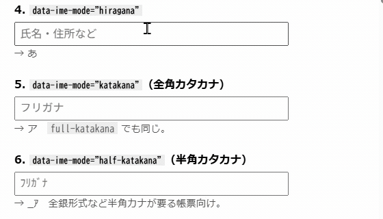

# caret-ime-badge

Windows で文字を入力する前に IME の状態を確認できるように、**テキストキャレットのすぐ横に IME の状態バッジを一瞬だけ表示する**常駐ツール。

タスクバーの通知領域は入力位置から遠く、視線移動が大きい。このツールは視線を入力位置から動かさずに状態を確認できるようにする。



上の GIF で IME を切り替えているのは別プロジェクトの [data-ime-mode](https://github.com/fukunagajiro/data-ime-mode) であり、本ツールが行うのは表示だけである。

## 表示

| 状態 | 表示 | 色 |
|---|---|---|
| ひらがな | あ | 緑 |
| 全角カタカナ | ア | 緑 |
| 半角カタカナ | ｱ | 緑 |
| 全角英数 | Ａ | 青 |
| 半角英数 | A | 青 |
| OFF（直接入力） | A | グレー |

半角英数と OFF は表示文字が同じなので、色で区別する。

## 動作

- 入力可能なコントロールにフォーカスした時と、IME モードが変化した時にバッジが出る
- `ShowDurationMs`（既定 800ms）が経過するとフェードアウトが始まる
- 文字を打ち始める（キャレットが動く）と、その時点でフェードアウトが始まる — 入力前の確認が目的なので、入力中はいつまでも居座らない
- フォーカスしていたフィールドが編集不可になった（キャレットが取得できなくなった）場合だけは、フェードなしで即座に消える

## トレイメニュー

通知領域のアイコンは実行時に描画する。緑の角丸四角に濃色の「あ」を置いた 32x32 の図で、バッジ本体とは配色が逆になっている。色はどちらも `BadgeStyles` の同じ定数を使う。

アイコンを右クリックすると4項目が出る。

- **一時停止 / 再開** — バッジ表示のオン・オフをトグルする
- **設定ファイルを開く** — `settings.ini` をメモ帳で開く（存在しなければ生成してから開く）
- **設定を再読み込み** — `settings.ini` を読み直し、変更を即座に反映する
- **終了** — アプリを終了する

アイコンのツールチップは通常 `caret-ime-badge` だが、フォーカス移動検知用のフック（`EVENT_OBJECT_FOCUS`）のインストールに失敗した場合は `caret-ime-badge (フォーカス検知が無効)` になる。これは「フォーカスが移った時にバッジを出す」という表示トリガーの片方が効いていないことを示す唯一のサインなので、動作がおかしいと感じたらまずここを見る。

## ビルド

.NET SDK も NuGet も不要。`build.cmd` は Windows にプリインストールされている C# コンパイラ（`C:\Windows\Microsoft.NET\Framework64\v4.0.30319\csc.exe`）を直接呼び出してビルドする。

```
build.cmd
```

`build\caret-ime-badge.exe` ができる。ダブルクリックで起動するとトレイに常駐する。

## テスト

`build-test.cmd` も同じ csc.exe を使い、テストコードを含めてコンソール版の `selftest.exe` をビルドする。

```
build-test.cmd
build\selftest.exe --self-test
```

終了コードが失敗件数（0 なら全件成功）。現在 105 件のアサーションがある。

`caret-ime-badge.exe --self-test` でも同じテストを実行できる（起動時に親コンソールへの接続を試みる）が、出力を確実に確認できるのはコンソール版の `selftest.exe` のほう。

## 設定

exe と同じディレクトリの `settings.ini`（初回起動時に自動生成）。トレイメニューの「設定を再読み込み」で反映する。

| キー | 既定値 | 意味 | 許容範囲（範囲外はクランプ） |
|---|---|---|---|
| `Opacity` | `0.88` | バッジの不透明度 | 0.1 – 1.0 |
| `ShowDurationMs` | `800` | 表示時間（ミリ秒） | 0 以上 |
| `FadeDurationMs` | `200` | フェードアウト時間（ミリ秒） | 0 以上 |
| `CaretMoveThresholdPx` | `2` | 入力開始とみなすキャレット移動量（ピクセル） | 0 以上 |
| `PollIntervalMs` | `120` | ポーリング間隔（ミリ秒） | 16 – 5000 |
| `OffsetX` / `OffsetY` | `6` / `-4` | キャレットからの位置オフセット | 制限なし |
| `FontSize` | `10` | 文字サイズ | 4 – 72（クランプ値。実用は 4 – 16 程度） |

範囲外の値を書いても起動時にエラーにはならず、範囲内に丸められる（クランプされる）。設定ファイルの1つの値のタイプミスでアプリ全体が起動しなくなる事態を避けるための挙動。

**`FontSize` の実用範囲は 4〜16 程度。** バッジウィンドウは `Size(38, 24)` 固定でフォントに合わせて再計算されないため、12〜13pt を超えるとグリフが箱からはみ出して欠ける。クランプ自体は 4〜72 を許容するが、それは「エラーで落ちない」ことの保証であって「見た目が正しい」ことの保証ではない。

## 既知の制約

### バッジが出ない、または見えないもの

| 対象 | 症状 | 原因 |
|---|---|---|
| 管理者権限で動くアプリ | 出ない | UIPI により、昇格していないプロセスは昇格プロセスのアクセシビリティ情報を読めない |
| キャレット位置を公開しないアプリ | 出ない | MSAA と UI Automation のどちらからもキャレット矩形が取れない |
| エクスプローラーの検索ボックス | 出ない | Windows 11 の XAML 化されたコントロール（`InputSiteWindowClass`）。MSAA は全ゼロを返し、UIA は `ControlType.Pane` で `TextPattern` に応答しない |
| エクスプローラーのファイル一覧 | 出ない | `DirectUIHWND`、role `LISTITEM(0x22)`。MSAA が全ゼロを返す。編集不可なコントロールなので意図どおり |
| XAML/WinUI の空の入力欄 | 出ない | 空のときは UIA がキャレット矩形を返せず、MSAA も全ゼロになる。表示すべき位置が存在しない |
| タスクバーの検索ボックス | 描画されているが見えない | シェルの検索フライアウトが、最前面に置いたバッジよりさらに前面に描かれる |
| エクスプローラーのアドレスバー | 出る時と出ない時がある | 同じ `InputSiteWindowClass` だが、UIA 種別は `ControlType.Edit` で `TextPattern` に応答する |
| Windows Terminal | 出てもごく一瞬で消えることがある | UIA から得るキャレット矩形がプロンプトの描画にあわせて動き、移動判定が発火する |
| Visual Studio Code の検索欄（`Ctrl+F` / `Ctrl+Shift+F`） | 開いた直後に一瞬で消える | 検索ウィジェットがスライドして開くあいだキャレットが動き、移動判定が発火する |

管理者権限のアプリは、本体を昇格させれば回避できる。常駐アプリとして割に合わないため対応しない。キャレット位置が取れない場合は、位置を推測せず何も表示しない。タスクバーの検索ボックスに回避策は実装していない。

実測値は下記のとおり。

- エクスプローラーの検索ボックス — `focusCls=InputSiteWindowClass`、MSAA `accFocus` role `CLIENT(0x0A)`、`OBJID_CARET` 全ゼロ、UIA `ControlType.Pane`
- タスクバーの検索ボックス — `proc=SearchHost`、`role=TEXT(0x2A)`、`textPattern=True`。MSAA が全ゼロのため UIA が応答する経路になる
- エクスプローラーのアドレスバー — UIA が返す矩形は3通りに割れた。`(324,346) 17x19` は妥当性ガードを通過してバッジが出る。`(324,346) 220x19` は要素全体の矩形で棄却される。矩形が一切返らないこともある。どれになるかはタイミング次第で、狭い矩形をたまたま得られたときだけバッジが出る
- XAML/WinUI の空の入力欄 — メモ帳の `Ctrl+F` 検索ボックスなどが該当する

エクスプローラーでも、F2 名前変更のような古典的な Win32 `Edit` コントロールは MSAA 経由で安定して動作する。同じアプリでも、コントロールの実装世代で結果が変わる。

Visual Studio Code の `Ctrl+F` と `Ctrl+Shift+F` は、ウィジェットがスライドしながら開く。**このスライドのあいだ、キャレット矩形が 120ms のポーリングごとに約 21px 下へ動く。** 実測では `(1384,69)` → `(1384,90)` → `(1384,112)` だった。「2px 以上動いたら入力開始とみなす」規則がこの移動で発火するため、開いた直後のバッジは 126ms で消える。スライドが終われば矩形は静止し、次に出るバッジは 885ms 保つ。Windows Terminal と同じく、利用者ではなくアプリ自身がキャレットを動かしている事例である。

打鍵すると 1 文字あたり 13px 動くので、そこでもフェードが始まる。こちらは入力開始を検知する仕様どおりの動作である。

この計測は `--probe-trigger` 相当の診断モードをアプリに一時的に戻して行った。**外部プロセスから MSAA / UIA を直接呼ぶ方法では正しく測れない。** PowerShell から同じ API を同じウィンドウに対して呼ぶと、VS Code では MSAA が全ゼロを返し、UIA の行全体の矩形しか見えなかった。アプリ内部からは 155 サンプルすべてで MSAA が `1x17` 〜 `1x19` のキャレットを返しており、UIA は一度も呼ばれていない。

### 位置がずれることがある

同じ入力欄でも、キャレットの取得元が MSAA と UI Automation の間で切り替わると、バッジの位置が少しずれることがある。実測ではメモ帳で MSAA が `(55,99) 1x15`、UI Automation が `(55,83) 1x31` を返しており、Y座標で16pxのずれがあった。

### 試して取り消したもの

空の XAML/WinUI 入力欄について、要素自身の矩形で代用する対策を検討した。取り消したのは、その矩形がレイアウトの再計算のたびに動き、ユーザーの入力によるキャレット移動と区別がつかないためである。実測ではメモ帳の検索バーの要素矩形が、120ms のポーリング間隔のあいだに最大 95px 動いた。「2px 以上動いたら入力開始とみなす」規則を当てると、バッジは表示直後に消える。

表示直後の一定時間だけ移動判定を止める猶予期間も実装した。これも取り消した。Windows Terminal で新規タブを開くと、バッジの実効表示時間が 800ms の設定に対し 120〜380ms に短縮される事例が残ったためである。実使用でも「プロンプトが表示される前にバッジの表示が終わる」という体感が拭えなかった。

### 未検証

Microsoft IME 以外のサードパーティ IME は未検証。IMM32 互換経路を持つものは動作する見込み。

## 動作確認済み

開発中に実際に測定した結果。キャレット位置の取得元（MSAA が主手段、UI Automation が補完）はアプリごとに異なり、これは外から見えない非自明な部分なので明記する。

| アプリ | 取得元 | 備考 |
|---|---|---|
| メモ帳 | MSAA | キャレット矩形 `1x15`。打鍵のたびに正しく追従することを確認済み |
| エクスプローラー（F2 名前変更、Win32 `Edit`） | MSAA | 実測 `(460,441) 1x15`。安定して動作する。**Windows 11 の検索ボックス・アドレスバーとは別物**（下記参照） |
| エクスプローラー（アドレスバー） | UIA（間欠的） | `InputSiteWindowClass`／UIA `ControlType.Edit`。実測で矩形が3通りに割れた: `17x19`（妥当性ガード通過、バッジが出る）、`220x19`（要素全体、棄却）、矩形なし。タイミング依存で確実ではない |
| Microsoft Edge | MSAA | UI Automation もこのフィールドに応答するが、位置がずれた矩形を返す。MSAA を先に試す実装が意味を持つのはこのため |
| Google Chrome | 未計測（MSAA と推定） | バッジがキャレット横に出ることを確認済み。キャレット矩形の取得元は計測していない。Edge と同じ Chromium であるため MSAA と推定する |
| Visual Studio Code（エディタ部分） | MSAA | エディタ部分は問題なく動作する。MSAA がキャレット矩形 `1x19` を返す。UI Automation に問い合わせた場合は行全体の矩形になり、妥当性ガード（幅が高さの4倍を超える矩形を棄却する）を通らない。MSAA を主手段にしている理由の一つ。行全体の幅はエディタの幅で変わるため、実測値も `1132x19` と `1663x19` の2通りある |
| Windows Terminal | UI Automation | MSAA はキャレットを取得できず失敗する。UI Automation にフォールバックして `9x19` を得るが、プロンプト描画にあわせて矩形が動くためバッジがごく一瞬で消えることがある（既知の制約を参照） |

エクスプローラーの検索ボックスとファイル一覧では、バッジは一切出ない。アドレスバーは同じ `InputSiteWindowClass` だが `TextPattern` に応答する点が異なり、上表のとおり間欠的に動作する。検索ボックスとアドレスバーは別物なので混同しないこと。実測値は「既知の制約」にある。

Chrome は動作を確認済み（バッジがキャレット横に出ることを確認）。ただしキャレット矩形の取得元は計測しておらず、上表の取得元は Edge と同じ Chromium であることからの推定である。Cursor は実測セッションを記録していない。Edge（Chromium）・VS Code（Electron）と同じレンダリングエンジンを使うため同様に動作すると**予想**されるが、**確認はしていない**。Slack・Discord・Teams は開発機に未インストールのため未検証。

## 仕組み

- IME 状態: `ImmGetDefaultIMEWnd` で得た IME ウィンドウへクロスプロセスに `WM_IME_CONTROL` を送る（`ImmGetContext` はプロセス内専用のため使えない）
- キャレット位置: MSAA の `OBJID_CARET` を主手段とする。UI Automation の `TextPattern` を見るのは、MSAA が全ゼロの矩形を返したときだけである。MSAA が座標を返したなら、その矩形が妥当性ガードを通らなくても UI Automation には問い合わせない。幅 0 の矩形は「テキスト欄にフォーカスが無い」という答えであり、ここで問い合わせると Web ページ本体が `TextPattern` に応答して別位置にバッジが出る（Chromium で実測）。判定は `CaretLocator.ChooseCaret` にある
- オーバーレイ: `WS_EX_NOACTIVATE` によりフォーカスを奪わない。これがないとバッジを出した瞬間に対象アプリの IME 状態が壊れる
